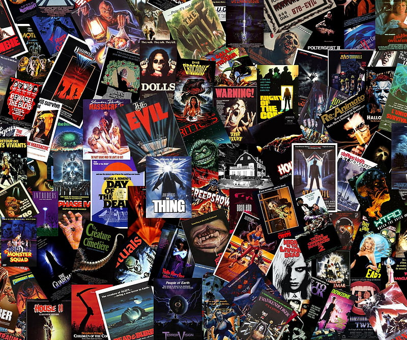

# Introduction

Cinema made its debut in the late 19th century and has become a multibillion-dollar industry, distributed over many different countries, and therefore made subject to distinct cultures and trends. Using the CMU Movie Summary Corpus, a collection of 42.306 movie plot summaries extracted from Wikipedia, aligned with movie and character metadata, we take a trip through time to take a look at these trends and how they have (or have not) differed across the world.
We will analyze movies from some of the largest film industries (aka the Big Five) - namely the United States, India, United Kingdom, Japan, and France - from the 1950s to the 2010s.

Our saga happens in 4 installments. In [Selecting the data](/data.md) we show what data we explore during this journey.
In [Diversity analysis of actors](/diversity.md) we take a look at diversity across industries.
We answer the question of how movie durations might differ in [How long will I be in the theater](/duration.md).
Finally, in [A deeper look at movie summaries](/nlp.md) we use NLP techniques to discover common trends.

So, what are the differences between the largest movie industries and how have they changed over time?
Let the ~~movie~~ data story begin!