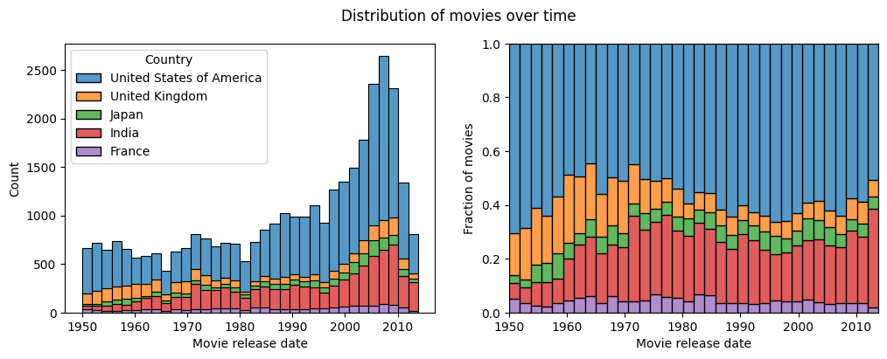

# Selecting the data

This project uses the CMU Movie Summary Corpus, a collection of 42.306 movie plot summaries extracted from Wikipedia.
It also includes metadata about the movie and the characters in them.
As the aim is to make an analysis of each large movie industry, we only consider movies that come from a single country.
More specifically, we keep movies from countries with [largest movie industries](https://www.boxofficepro.com/global-box-office-down-72-digital-leads-home-entertainment-in-2020) and that have enough samples in the dataset.
We are left with movies from the United States of America, India, United Kingdom, Japan, and France.
Splitting our dataset over different decades gives us the following distribution of movies across time:

Our samples are ready, let's take a look at [diversity of actors](/diversity)!