# Diversity analysis of actors

Our first question is about the faces of the industry, the actors.
How diverse are they?
Has it changed over time?
Do some countries consistently hire a more diverse cast than others?
To answer these questions, we take a trip through the movie character dataset, which gives us a couple of insights on the physical attributes of the actors that portray them.

First, looking at gender, we see that all industries are **heavily dominated by men**:

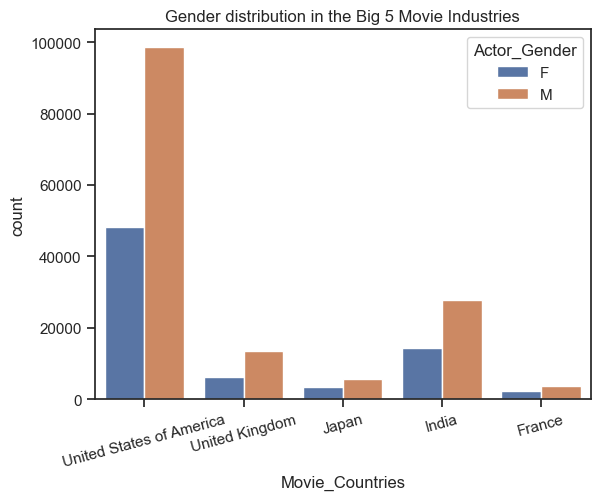

In a truly diverse world where each industry aims to have equal representation, the ratio of actresses over actors should be close to 1.
Looking at this ratio over time, we observe that most countries are evolving towards that trend, some faster than others:

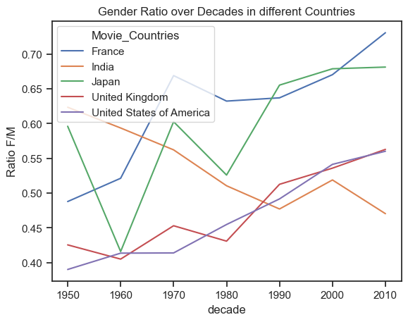

Indeed, France and Japan seem to take the lead in actress representation, while India is going backwards with more male actors over time and becoming less representative than the US and the UK.
**Japan and France take the win for gender representation**.

Regarding the age of our performers, we see **a trend towards older actors and actresses** alike, although this effect is weaker for women.
This is the age at movie release date, which is good news for actors that started out young and could maintain a long career.

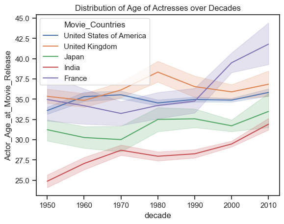

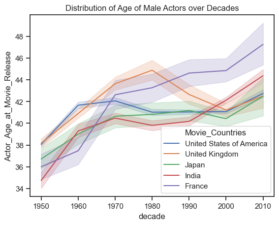

But what about the diversity in ages?
Looking at the standard deviation of ages in each industry, we see a **global increase of diversity in ages**, with US and UK plateauing since the 70s.

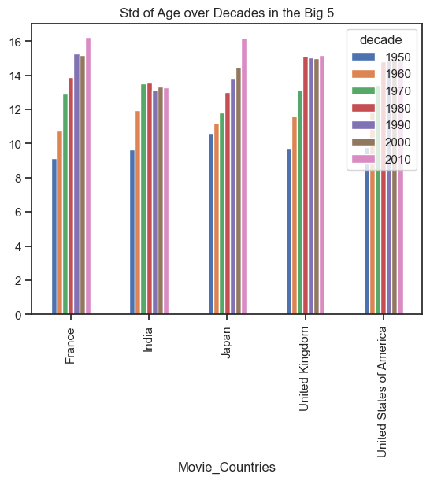

<!-- 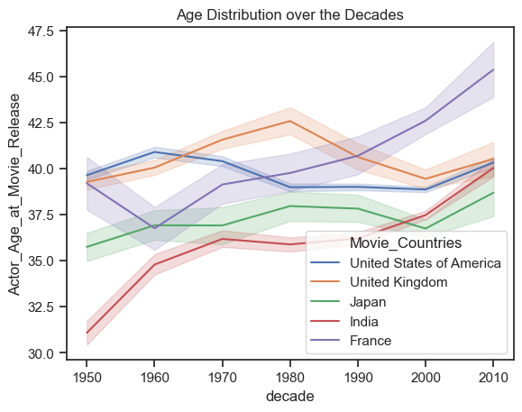 -->

We see a similar **upwards trend of height diversity** among actors across the globe.
In the observed timeframe Japan has the lowest height span and thus less diversed actors w.r.t. height whereas the UK and US have the highest span. 
Over the decades the span was at a minimum in the 50's and increased strongly after that. Since the 90's the span is at around 1.40 - 1.50 m.

When looking at the evolution per country we see that the height diversity has increased so much in the 50's only because there were more movies in the US with more varying heights. 
In France, India and Japan the increase happened 40 to 50 years later.

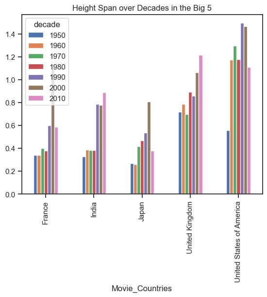

An interesting observation to make is the difference in height between industries.
If we make a regression and try to predict actors' height with the movie's country and the decade it came out, the decade has close to no predictive power.
As we see below, actors in Japanese movies are significantly shorter, while actors in the US and UK are taller.
Given that these populations are in general shorter and taller respectivelly, it indicates that each industry is still hiring a majority of **local** talent.

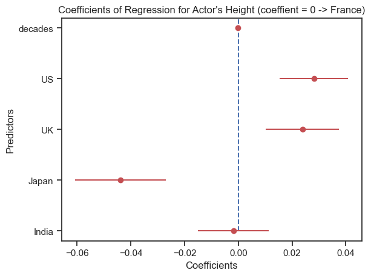

Let's take a look at the final category of diversity, ethnicities among actors.
The majority of top actor ethnicities are native to the industry's country:

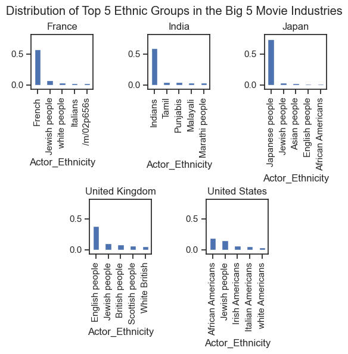

As seen in the figure above, analyzing the diversity in ethnicities is not trivial.
A couple of ethnicities may overlap or include others (e.g. British people vs White British).
Our conclusions about ethnicity diversity will therefore be less strong than the former attributes.

But let's give it a try and analyze diversity among ethnicities.
The ratio between number of ethnic groups and number actors is not a proper metric as the number of ethnic groups is finite and grows slower whereas the number of actors could grow much faster. 
We will therefore lean on a measure similar to the *ethno-lingustic fractionalization index* from the book: *New Approaches to the Dynamics, Measurement and Economic Implications of Ethnic Diversity by Philipp Kolo*.
That is, the ratio between the number of ethnic groups and the total number of ethnic groups, namely [650 according to a survey in 2002](https://www.washingtonpost.com/news/worldviews/wp/2013/05/16/a-revealing-map-of-the-worlds-most-and-least-ethnically-diverse-countries/):

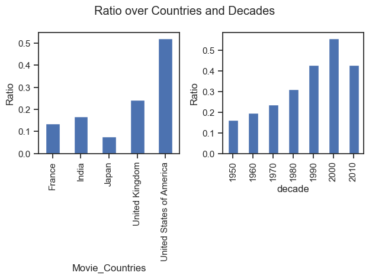

We can clearly see an upwards trend in ethnicity representation.
The US has the highest ratio whereas Japan has the lowest one.
But as the following graphic shows, the ratio has increased over time in every country:

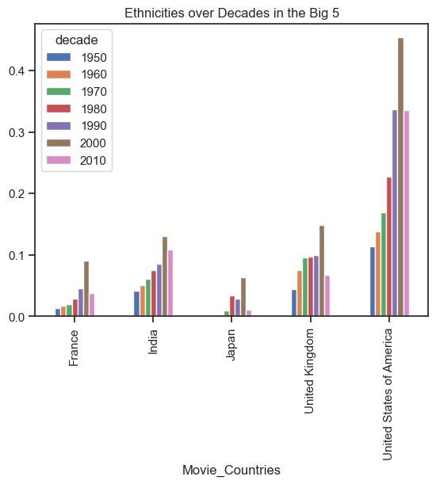

Note that in both cases, the 2010 decade is an anomaly as it only includes movies up to 2013, and is missing 7 years of that epoch.

## Conclusion

We have seen gender representation with France and Japan taking the lead, age and height diversity increasing globally, and highest diversity of actor ethnicities in the US.
By combining the four metrics together into one diversity metric, we can draw our final conclusion on actor diversity across the industries:

Discarding the data from 2010 (missing 7 years), the US has the highest diversity of actors followed by France.
India has the lowest diversity which stagnated since the 70's. 
To conclude, while some countries are further than others, **diversity in the movie industry is on the rise and shows no sign of stopping**:

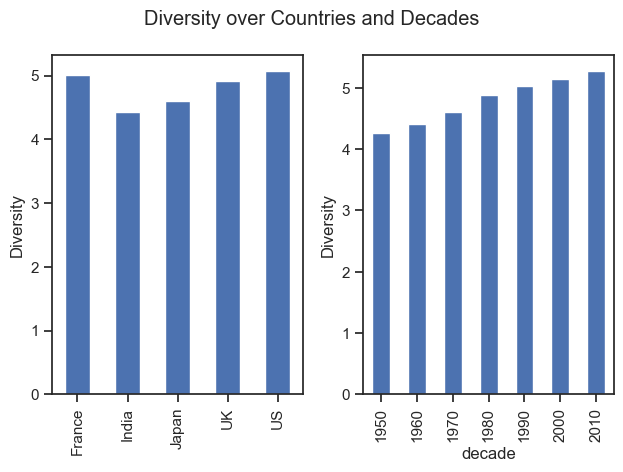

