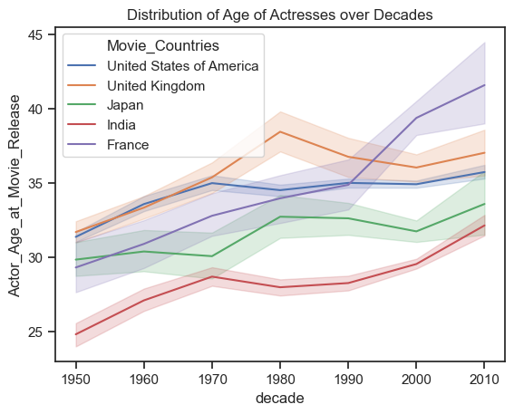
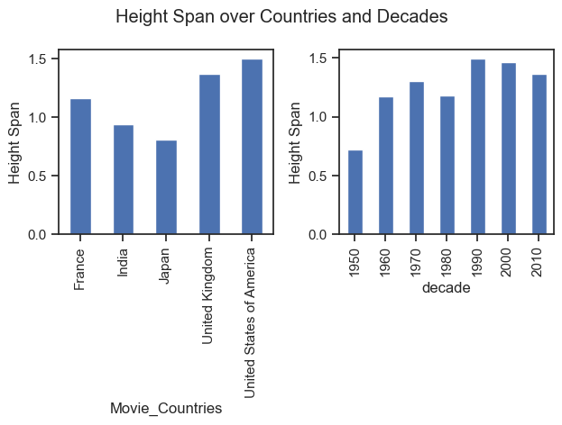

# Diversity analysis of actors

Our first question is about the faces of the industry, the actors.
How diverse are they?
Has it changed over time?
Do some countries consistently hire a more diverse cast than others?
To answer these questions, we take a trip through the movie character dataset, which gives us a couple of insights on the physical attributes of the actors that portray them.

## Gender

## Age

## Height

## Ethnicity

## Actor diversity

