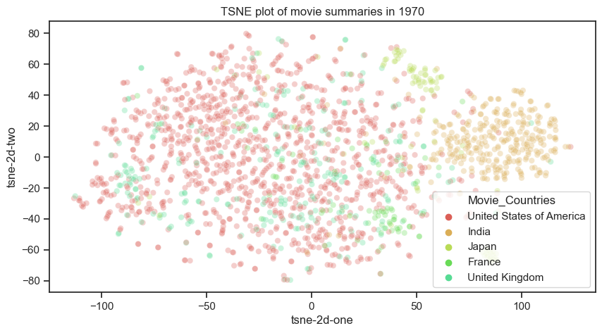
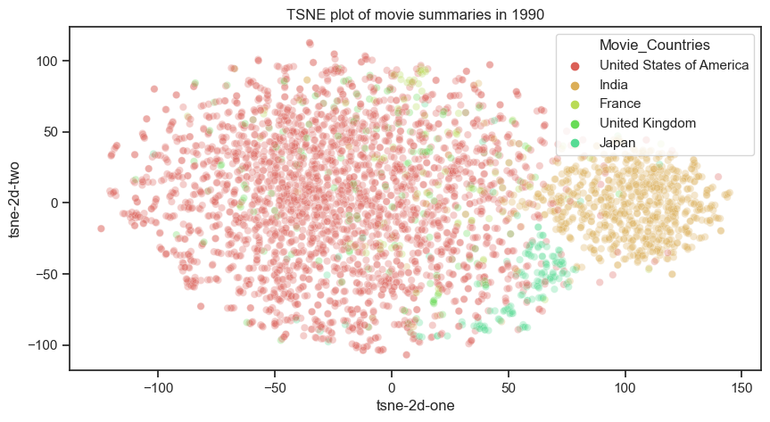
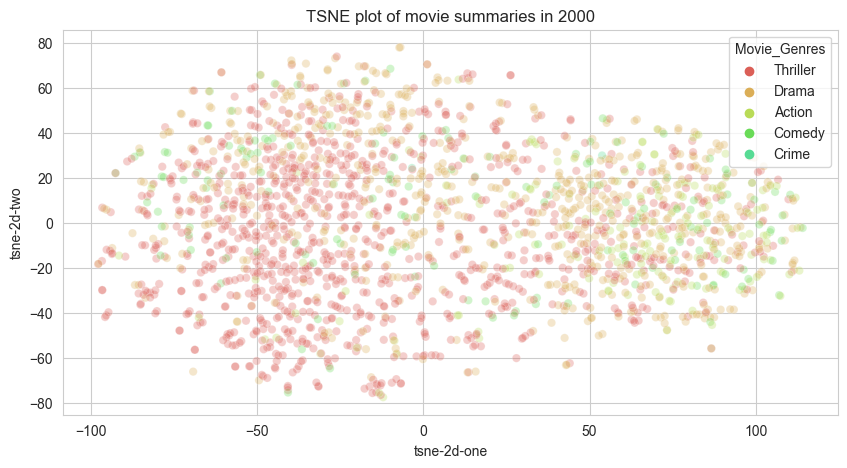

# Exploring movie plots
Our research question is to understand how movie plots are structured and whether they differ across industries, decades, and genres. To answer this question, we created an NLP pipeline to:

1. Study the words used in plots
2. Compare them across different diversity attributes
3. Perform semantic analysis and check for similarities
4. Propose a method to extract keypoints from summaries

## Bag of words
We begin by studying the words used in plot summaries and examining the general word usage across all plots.

<iframe src="https://giphy.com/embed/7kFiPRhn3aDYs" width="480" height="270" frameBorder="0" class="giphy-embed" allowFullScreen></iframe>

Now bring your loop and let's search from where they are comming. 

### Across decades

From these word clouds, we can observe that movies from the 50s, 60s, and 70s contain more action-related words such as "escape," "kill," and "dead," while movies from the 2000s tend to focus more on relationships and drama. We can investigate this further by excluding articles and common empty words and plotting the standardized distributions of the top 20 words.

### Across industries
To save space, we will directly show the distribution of the 40 most common words across industries. 

We can see that the Indian industry tends to focus on love and family relationships, resulting in a focus on drama. Meanwhile, the French industry is a mixture of drama-linked words and crime. This will be more evident when we analyze the genres.

### Across genres
Analysing the distributions of the genres, Thriller, Crime fiction and Drama were among the top 3 movie genres.

We notice that there is a lot of action based verbs/event (murder, killed, escape, leave). 
Now we take Us and UK and compare them for the same genre.

Taking 2 countries and the same genre, we notice that there is an overlap but still each have unique attributes. Highliting that the industry plays a role.

## Semantic analysis 
In natural language processing (NLP), semantic similarity refers to the degree to which two pieces of text or language convey the same or similar meaning. It can be used to measure the similarity of words, phrases, sentences, or entire documents.

To further understand and visualize the structures and similarities of movie plots, we will use t-SNE (t-distributed Stochastic Neighbor Embedding) to project the embeddings generated by the all-MiniLM-L6 model onto a 2D space. This will allow us to more easily interpret and analyze the semantic differences between the plots and their embeddings.

In addition to analyzing the differences across countries, genres, and decades, as we have done in our diversity study, we will use t-SNE to visualize these differences and gain further insights into the structures and patterns present in the movie plots.

A major aspect, we notice after performing tsne, that the indian movie plots especially starting the 70s are unique to themselves whereas the western movies are similiar semantically to one another.

Doing the same across the genres for the same decade showed that sementacilly the plots have a high similarity. 
We can see it for example for the case of the 2000's

